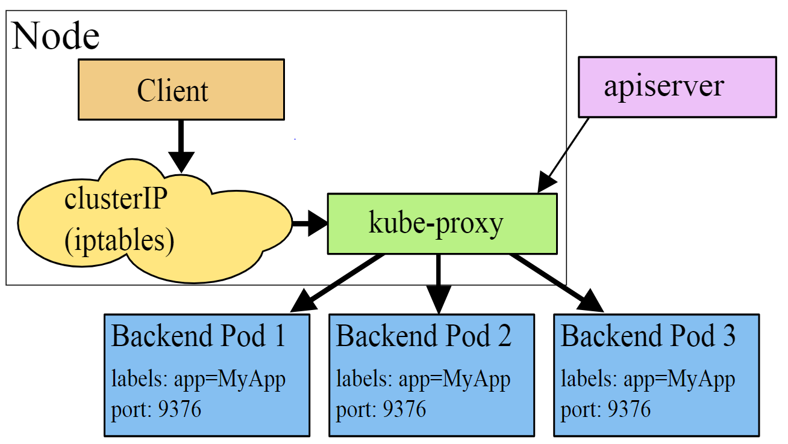
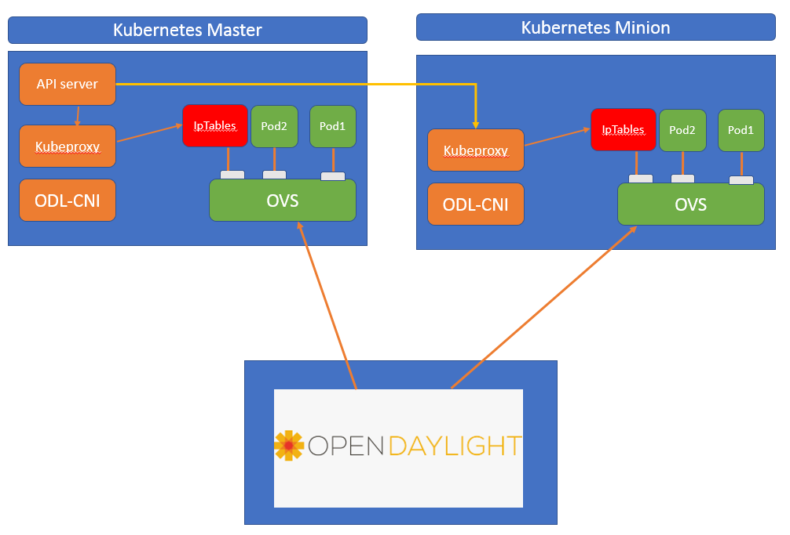

.. contents:: Table of Contents
      :depth: 5

============================================================================
Netvirt COE Integration for Kubernetes Services with KubeProxy IpTables Mode
============================================================================

https://git.opendaylight.org/gerrit/#/q/topic:service_implementation

This spec proposes how to integrate COE and Netvirt projects for enabling
kubernetes services support.

A Kubernetes Service is an abstraction which defines a logical set of Pods and a policy by which to access them -
sometimes called a micro-service. The set of Pods targeted by a Service is (usually) determined by a Label Selector.

As an example, consider an image-processing backend which is running with 3 replicas. Those replicas are fungible
-frontends do not care which backend they use. While the actual Pods that compose the backend set may change,
the frontend clients should not need to be aware of that or keep track of the list of backends themselves.
The Service abstraction enables this decoupling.

For Kubernetes-native applications, Kubernetes offers a simple Endpoints API that is updated whenever the set of Pods
in a Service changes. For non-native applications, Kubernetes offers a virtual-IP-based bridge to Services which
redirects to the backend Pods.

Problem Description
===================

Current Netvirt project does not support Kubernetes services, and only provides basic L2, L3 connectivity
between pods. This spec aims at enabling the same, and will require a plugin in Netvirt project
to convert the service events from Kubernetes to the required constructs in Netvirt.

Implementation scope
====================

A Service in Kubernetes is a REST object, similar to a Pod. Like all of the REST objects,
a Service definition can be POSTed to the apiserver to create a new instance.

Every node in a Kubernetes cluster runs a kube-proxy. kube-proxy is responsible for implementing a form of
virtual IP for Services of type other than ExternalName. In Kubernetes v1.0, Services are a “layer 4” (TCP/UDP over IP)
construct, the proxy was purely in userspace. In Kubernetes v1.1, the Ingress API was added (beta) to represent
“layer 7”(HTTP) services, iptables proxy was added too, and became the default operating mode since
Kubernetes v1.2. In Kubernetes v1.8.0-beta.0, ipvs proxy was added.

The scope of this implementation spec is only to realize the Kubeproxy - iptables mode based services
implementation.

High-Level Components for Kubeproxy-iptables mode
=================================================

Unlike Pod IP addresses, which actually route to a fixed destination, Service IPs are not actually answered by a
single host. Instead, we use iptables (packet processing logic in Linux) to define virtual IP addresses
which are transparently redirected as needed. When clients connect to the VIP,
their traffic is automatically transported to an appropriate endpoint.

kubeproxy:iptables mode based services works as in the below diagram :

Proposed change
===============

The high level components of the kubeproxy:iptables mode based solution is given in the below picture :

`netvirt\coe` module should be able to convert COE `services` related constructs to relevant netvirt
constructs, and program required flows on OVS to take the service ip destined traffic to the iptables.

OVS changes
-----------

To realize the iptables based solution, an internal veth port needs to be created on the OVS on each Kubernetes node.
This veth port acts as the gateway for all service IP traffic. Specific external-ids should be set
in OVSDB tables for this veth port to indicate that this is a special port.

Netvirt Changes
---------------

netvirt/coe
^^^^^^^^^^^

netvirt/coe module should be able to detect the service-gateway port creation from ovsdb southbound,
and make this port part of the same ELAN domain as per the namespace information. `netvirt\coe` will
not make this gateway port a vpn-interface.

Use Cases
---------

Use Case 1: Pod to Service Connectivity
^^^^^^^^^^^^^^^^^^^^^^^^^^^^^^^^^^^^^^^

When a Pod has to communicate to a Service IP, the packets will be redirected to the service-gateway port
via the OpenFlow rules programmed on the OVS, as both the POD port and service-gateway port will be
part of the same ELAN domain. Service-gateway port will take the traffic for an IP table lookup, where
the traffic headers will be modified to match the destination pod IP. After the header modifications, the
traffic will flowback to OVS, where the usual POD connectivity openflow rules will take care of
forwarding the packet to the appropriate node.

Use Case 2: Node to Service Connectivity
^^^^^^^^^^^^^^^^^^^^^^^^^^^^^^^^^^^^^^^^

<TBD>

Use Case 3: Service to External IP Connectivity
^^^^^^^^^^^^^^^^^^^^^^^^^^^^^^^^^^^^^^^^^^^^^^^

<TBD - For a quick prototype, a default flow was added in table 21 to resubmit the packets to ELAN pipeline>

Pipeline Changes
----------------

No pipeline changes will be introduced as part of this feature.

Workflow
--------

Kubernetes Node Join
^^^^^^^^^^^^^^^^^^^^

#. ovs: Deployment script creates veth-port of type "internal".
#. odlovs-cni: Deployment script injects odlovs-cni.conf to set the service-gateway for each pod to be spawned.
#. node: Deployment script add required routes on the node for pod-network-gateway as well as service gateway.
#. netvirt/coe: the service-gateway port will be made part of the same ELAN domain as other pods on the node,
   by creating an elan-interface for the same.

Create Service
^^^^^^^^^^^^^^
#. coe/coe-northbound: User created list of PODs
#. netvirt/coe: netvirt sets up rules for basic l2/l3 connectivity for the pods.
#. coe/coe-northbound: User attaches the PODs to a Service.
#. Kubernetes: Kubeproxy injects necessary iptables rules for redirecting the service traffic to the respective pod.

Delete Service
^^^^^^^^^^^^^^

#. Deleting a service will not have any action on ODL, as kube-proxy will take care of
   removing the iptables rules.

Limitations
-----------
The proposed implementation works only in a FLAT  namespace model.

Reboot Scenarios
----------------
This feature support all the following Reboot Scenarios for EVPN:
    *  Entire Cluster Reboot
    *  Leader PL reboot
    *  Candidate PL reboot
    *  OVS Datapath reboots
    *  Multiple PL reboots
    *  Multiple Cluster reboots
    *  Multiple reboots of the same OVS Datapath.

Clustering considerations
-------------------------
The feature should operate in ODL Clustered environment reliably.

Other Infra considerations
--------------------------
N.A.

Security considerations
-----------------------
N.A.

Scale and Performance Impact
----------------------------
iptables based solution has inherent scale limitations, as each packet destined for service ip has to goto
for an iptables lookup, and then come back to OVS after the header changes post the lookup.
The perfect solution will be to have the loadbalancing rules programmed as openflow rules on OVS,
based on an agent on each Kubernetes node which will be communicated about the service endpoints.

Targeted Release
----------------
Neon

Usage
=====

Features to Install
-------------------
This feature add the below new feature :

    * odl-netvirt-coe

REST API
--------

Creating SERVICE directly in COE
^^^^^^^^^^^^^^^^^^^^^^^^^^^^^^^^

**URL:** restconf/config/service:service-information

**Sample JSON data**

.. code-block:: json

  {
    "service:service-information": {
      "service:services": [
        {
          "service:uid": "EeafFFB7-D9Fc-aAeD-FBc9-8Af8BFaacDD9",
          "service:cluster-ip-address": "5.21.5.0",
          "service:endpoints": [
            "AFbcF0EB-Fc3f-acea-A438-5CFDfCEfbcb0"
          ]
        }
      ]
    }
  }

Assignee(s)
-----------

Primary assignee:
  Faseela K <faseela.k@ericsson.com>

Other contributors:
   Frederick Kautz <fkautz@redhat.com>
   Sam Hague <sam.hague@redhat.com>

Work Items
----------

Dependencies
============

Testing
=======

Junits
------

This feature will support following use cases:

* TC 1: Create a POD within a node under a namespace
* TC 2: Attach a POD to service
* TC 3: Remove a POD from service
* TC 4: Delete a POD from a namespace

CSIT
----
CSIT will be enhanced to cover this feature by providing new CSIT tests.

Documentation Impact
====================
This will require changes to User Guide and Developer Guide.

References
==========

* Kubernetes services  - https://kubernetes.io/docs/concepts/services-networking/service/