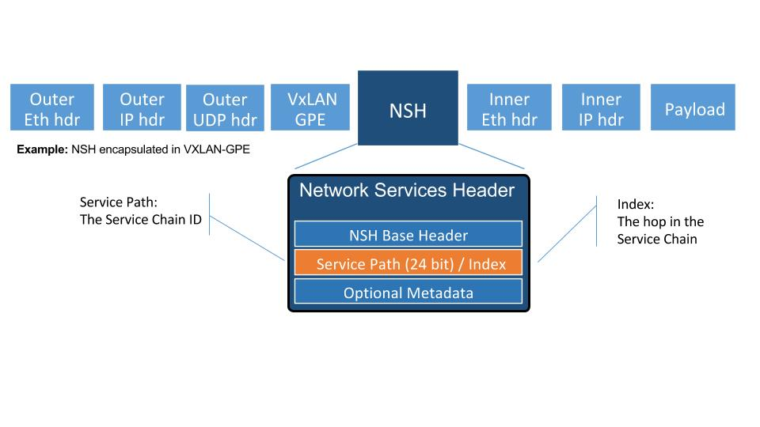

.. contents:: Table of Contents
      :depth: 3

==================
New SFC Classifier
==================

https://git.opendaylight.org/gerrit/#/q/topic:new-sfc-classifier

The current SFC Netvirt classifier only exists in the old Netvirt.
This blueprint explains how to migrate the old Netvirt classifier
to a new Netvirt classifier.

Terminology
===========

- NSH - Network Service Headers, used as Service Chaining encapsulation. NSH RFC Draft [1]

- NSI - Network Service Index, a field in the NSH header used to indicate the next hop

- NSP - Network Service Path, a field in the NSH header used to indicate the service chain

- RSP - Rendered Service Path, a service chain.

- SFC - Service Function Chaining. SFC RFC [2] ODL SFC Wiki [3].

- VXGPE - VXLAN GPE (Generic Protocol Encapsulation) 
  Used as transport for NSH. VXGPE uses the same header format as traditional
  VXLAN, but adds a Next Protocol field to indicate NSH will be the next header.
  Traditional VXLAN implicitly expects the next header to be ethernet. VXGPE RFC
  Draft [4].

Problem description
===================

Detailed description of the problem being solved by this feature

The classifier is an integral part of Service Function Chaining (SFC).
The classifier maps client/tenant traffic to a service chain by matching
the packets using an ACL, and once matched, the classifier encapsulates
the packets using some sort of Service Chaining encapsulation. Currently,
the only supported Service Chaining encapsulation is NSH using Vxgpe as
the transport. Very soon (in the Carbon release) Vxlan will be added as
another encapsulation/transport, in which case NSH is not used.

In the Boron release, an SFC classifier was implemented, but in the
old Netvirt. This blueprint intends to explain how to migrate the
old Netvirt classifier to a new Netvirt classifier.

The following image details the packet headers used for Service Chaining
encapsulation with VXGPE+NSH.

Diagram source [5].

Use Cases
---------

The main use case addressed by adding an SFC classifier to Netvirt
is to integrate the 2 features, thus allowing for Service Chaining
to be used in an OpenStack virtual deployment, such as the OPNFV
SFC project [6].

Proposed change
===============

The existing old Netvirt SFC code can be found here:
    netvirt/openstack/net-virt-sfc/{api,impl}

The new Netvirt SFC code base will be located here:
    netvirt/aclservice/{api,impl}

Once the new Netvirt SFC classifier is implemented and working, the old
Netvirt SFC classifier code will be left in place for one project.

Integration with Genius
-----------------------

Genius [7], [8] is an OpenDaylight project that provides generic
infrastructure services to other OpenDaylight projects. New Netvirt makes
use of Genius and the new Netvirt classifier will also make use of Genius
services. Among these services, the interface manager, tunnel manager
and service binding services are of special relevance for the new
Netvirt classifier.

Genius interface manager handles an overlay of logical interfaces on
top of the data plane physical ports. Based on these logical interfaces,
different services/applications may be bound to them with certain
priority ensuring that there is no interference between them. Avoiding
interference between services/applications is called Application Coexistence
in Genius terminology. Typically, the effect of an application binding to
a logical interface is that downstream traffic from that interface will be
handed off to that application pipeline. Each application is then responsible
to either perform a termination action with the packet (i.e output action)
or to return the packet back to Genius so that another application
continues to handle the packet. There is a predefined set of types of
services that can bind, and ACL is one of them.

For OpenStack environments, Nevirt registers Neutron ports as logical
interfaces in Genius interface manager. Classifying traffic for a
client/tenant ultimately relies on classifying traffic downstream from
their corresponding Neutron ports. As such, Netvirt classifier can bind
on these interfaces as the ACL service through the Genius interface
manager. Currently, Netvirt security groups implementation also binds
with Genius as an ACL service, so there might be no need for this
binding. In any case, the classifier will need to be integrated in the
ACL pipeline with the security groups rules. Another option is to define
a new type of service in Genius for the classifier.

Netvirt also keeps track of the physical location of these Neutron
ports in the data plane and updates the corresponding Genius logical
interface with this information. Services integrated with Genius may
consume this information to be aware of the physical location of a
logical interface in the data plane and it's changes when a VM migrates
from one location to another. New Netvirt classifier will install the
ACL rules based on the data plane location of the client/tenant Neutron
ports whose traffic is to be classified. On VM migration, the
classifier has to remove or modify the corresponding ACL rules
accounting for this location change, which can be a physical node
change or a physical port change.

The classifier has to forward packets to a service function. This
service function, depending on how it was configured, may also be
located through a Neutron port registered in Genius as a logical
interface. It's location may be the same node as that of the Neutron
port whose traffic is being classified or a different node. In the
former case, the classifier will output the encapsulated packet to the
physical port corresponding to the logical interface. The specific
actions to achieve this are provided by Genius.

If the service function node is on a different compute host than the
client node, the encapsulated packet needs to be forwarded to that
node through a tunnel port. Tunnels are handled by the Genius tunnel
manager (ITM) with an entity called transport zone: all nodes in a transport
zone will be connected through a tunnel mesh. Thus the netvirt classifier
needs to ensure that the client node and the service function node
are included in a transport zone. The transport type is also specified
at the transport zone level and for NSH it needs to be vxlan-gpe. The
classifier needs to make sure that this transport zone is handled in
relation with client and service function location changes in the case
that either of the VMs migrate.

Pipeline changes
----------------
TODO add link to netvirt/genius pipeline

Yang changes
------------
The api yangs used for the classifier build on the ietf acl models in
mdsal.model. No new Yang changes will be introduced.

Configuration impact
--------------------
None

Clustering considerations
-------------------------
None

Other Infra considerations
--------------------------
Since SFC uses NSH, and the new Netvirt Classifier will need to add NSH
encapsulation, a version of OVS that supports NSH must be used. NSH has not
been officially accepted into the OVS project, so a branched version of OVS is
used. Details about the branched version of OVS can be found here [9].

Security considerations
-----------------------
None

Scale and Performance Impact
----------------------------
What are the potential scale and performance impacts of this change?
Does it help improve scale and performance or make it worse?

Targeted Release
-----------------
This change is targeted for the ODL Carbon release.

Alternatives
------------
None

Usage
=====
TODO
How will end user use this feature? Primary focus here is how this feature
will be used in an actual deployment.

e.g. For most netvirt features this will include OpenStack APIs.

This section will be primary input for Test and Documentation teams.
Along with above this should also capture REST API and CLI.

Features to Install
-------------------
TODO
odl-netvirt-openstack

Identify existing karaf feature to which this change applies and/or new karaf
features being introduced. These can be user facing features which are added
to integration/distribution or internal features to be used by other projects.

REST API
--------
TODO
Sample JSONS/URIs. These will be an offshoot of yang changes. Capture
these for User Guide, CSIT, etc.

CLI
---
None.

Implementation
==============

Assignee(s)
-----------

Primary assignee:
  TBD

Other contributors:
  <brady.allen.johnson@ericsson.com>
  <david.suarez.fuentes@ericsson.com
  <jaime.camaano.ruiz@ericsson.com>
  <miguel.duarte.de.mora.barroso@ericsson.com>

Work Items
----------
**Simple scenario:**

1. Extract the DPN-ID of the node hosting the client's VM

#. Extract the DPN-ID of the node hosting the first SF of the RSP

#. Forwarding logic 
   The forwarding logic to implement depends on the co-location of the client's
   VM with the first SF in the chain.

   - When the VMs are co-located (i.e. located in the same host), the output
     actions are to forward the packet to the first table of the SFC pipeline.
   - When the VMs are **not** co-located (i.e. hosted on different nodes) it is
     necessary to: 
     
     1. Use genius RPCs to get the interface connecting 2 DPN-IDs
     2. Use genius RPCs to get the list of actions to reach the tunnel endpoint.

**Enabling VM mobility:**

1. Handle first SF mobility - listen to RSP updates, where the only relevant
   migration is when the first SF moves to another node (different DPN-IDs).
   In this scenario, we delete the flows from the *old* node, and install the
   newly calculated flows in the new one.

2. Handle client VM mobility - listen to client's InterfaceState changes,
   re-evaluating the Forwarding logic, since the interface used to reach the
   target DPN-ID is different. This means the action list to implement it, will
   also be different.

3. **Must** keep both the client's host node, and the first SF host node within
   the same transport zone. By listening to InterfaceState changes of both the
   client & the first SF neutron ports, the transport zone rendering can be
   redone. TODO: *is there a better way to identify when the transport zone
   needs to be updated?*

Dependencies
============
No dependency changes will be introduced by this change.

Testing
=======
Capture details of testing that will need to be added.

Unit Tests
----------
Unit tests for the new Netvirt classifier will be modeled on the existing
old Netvirt classifier unit tests, and tests will be removed and/or added
appropriately.

Integration Tests
-----------------
The existing old Netvirt Classifier Integration tests will need to be
migrated to use the new Netvirt classifier.

CSIT
----
The existing Netvirt CSIT tests for the old classifier will need to be
migrated to use the new Netvirt classifier.

Documentation Impact
====================
User Guide documentation will be added by one of the following contributors:
  <brady.allen.johnson@ericsson.com>
  <david.suarez.fuentes@ericsson.com
  <jaime.camaano.ruiz@ericsson.com>
  <miguel.duarte.de.mora.barroso@ericsson.com>

References
==========

[1] https://datatracker.ietf.org/doc/draft-ietf-sfc-nsh/

[2] https://datatracker.ietf.org/doc/rfc7665/

[3] https://wiki.opendaylight.org/view/Service_Function_Chaining:Main

[4] https://datatracker.ietf.org/doc/draft-ietf-nvo3-vxlan-gpe/

[5] https://docs.google.com/presentation/d/1kBY5PKPETEtRA4KRQ-GvVUSLbJoojPsmJlvpKyfZ5dU/edit?usp=sharing

[6] https://wiki.opnfv.org/display/sfc/Service+Function+Chaining+Home

[7] http://docs.opendaylight.org/en/stable-boron/user-guide/genius-user-guide.html

[8] https://wiki.opendaylight.org/view/Genius:Design_doc

[9] https://wiki.opendaylight.org/view/Service_Function_Chaining:Main#Building_Open_vSwitch_with_VxLAN-GPE_and_NSH_support

