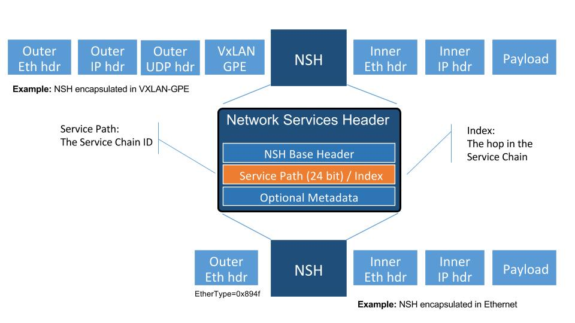

.. contents:: Table of Contents
      :depth: 3

==================
New SFC Classifier
==================

https://git.opendaylight.org/gerrit/#/q/topic:new-sfc-classifier

The current SFC Netvirt classifier only exists in the old Netvirt.
This blueprint explains how to migrate the old Netvirt classifier
to a new Netvirt classifier.

Terminology
===========

- NSH - Network Service Headers, used as Service Chaining encapsulation. NSH RFC Draft [1]

- NSI - Network Service Index, a field in the NSH header used to indicate the next hop

- NSP - Network Service Path, a field in the NSH header used to indicate the service chain

- RSP - Rendered Service Path, a service chain.

- SFC - Service Function Chaining. SFC RFC [2] ODL SFC Wiki [3].

- SF - Service Function

- SFF - Service Function Forwarder

- VXGPE - VXLAN GPE (Generic Protocol Encapsulation)
  Used as transport for NSH. VXGPE uses the same header format as traditional
  VXLAN, but adds a Next Protocol field to indicate NSH will be the next header.
  Traditional VXLAN implicitly expects the next header to be ethernet. VXGPE RFC
  Draft [4].

Problem description
===================

In the Boron release, an SFC classifier was implemented, but in the
old Netvirt. This blueprint intends to explain how to migrate the
old Netvirt classifier to a new Netvirt classifier, which includes
integrating the classifier and SFC with Genius.

The classifier is an integral part of Service Function Chaining (SFC).
The classifier maps client/tenant traffic to a service chain by matching
the packets using an ACL, and once matched, the classifier encapsulates
the packets using some sort of Service Chaining encapsulation. Currently,
the only supported Service Chaining encapsulation is NSH using VXGPE as
the transport. Very soon (possibly in the Carbon release) Vxlan will be
added as another encapsulation/transport, in which case NSH is not used.
The transport and encapsulation information to be used for the service
chain is obtained by querying the Rendered Service Path (RSP) specified
in the ACL action.

The transport and encapsulation used between the classifier and the SFF,
and also between SFFs will be VXGPE+NSH. The transport and encapsulation
used between the SFF and the SF will be Ethernet+NSH.

The following image details the packet headers used for Service Chaining
encapsulation with VXGPE+NSH.

Diagram source [5].

The problem was originally discussed using the slides in this link [12]
as a guideline. These slides are only intended for reference, and are not
to be used for implementation.

Use Cases
---------

The main use case addressed by adding an SFC classifier to Netvirt
is to integrate SFC with Netvirt, thus allowing for Service Chaining
to be used in an OpenStack virtual deployment, such as the OPNFV
SFC project [6].

SFC works with both OVS and VPP virtual switches, and its even possible
to have a hybrid setup whereby Netvirt is hosted on OVS and SFC is hosted
on VPP switches. This blueprint only addresses the use of SFC with NetVirt
and OVS.

As mentioned previously, currently SFC works with VXGPE+NSH and Eth+NSH
transport/encapsulation, and soon SFC will work with VXLAN as the transport and
encapsulation. The first version of this implementation will focus on VXGPE+NSH
and Eth+NSH. In the future, when VXLAN is implemented in SFC, VXLAN can be added
to the Netvirt SFC classifier. Changes in the transport and encapsulation
used for service chains will have no affect on the Netvirt ACL model, since
the transport and encapsulation information is obtained via the RSP specified
in the RSP.

Proposed change
===============

The existing old Netvirt SFC code can be found here:

- netvirt/openstack/net-virt-sfc/{api,impl}

Once the new Netvirt SFC classifier is implemented and working, the old
Netvirt SFC classifier code will be left in place for at least one release
cycle.

The new Netvirt SFC code base will be located here:

- netvirt/vpnservice/sfc/classifier/{api,impl}

The new Netvirt SFC classifier implementation will be new code. This
implementation is not to be confused with the existing Netvirt aclservice,
which is implemented for Security Groups. More details about the Genius
integration can be found in the following section, but the Netvirt SFC
classifier will be in a new Genius classifier service. The SFC
implementation is already integrated with Genius and is managed via
the Genius SFC service.

Integration with Genius
-----------------------

Genius [7], [8] is an OpenDaylight project that provides generic
infrastructure services to other OpenDaylight projects. New Netvirt makes
use of Genius and the new Netvirt classifier will also make use of Genius
services. Among these services, the interface manager, tunnel manager
and service binding services are of special relevance for the new
Netvirt classifier.

Genius interface manager handles an overlay of logical interfaces on
top of the data plane physical ports. Based on these logical interfaces,
different services/applications may be bound to them with certain
priority ensuring that there is no interference between them. Avoiding
interference between services/applications is called Application Coexistence
in Genius terminology. Typically, the effect of an application binding to
a logical interface is that downstream traffic from that interface will be
handed off to that application pipeline. Each application is then responsible
to either perform a termination action with the packet (i.e output or drop
action) or to return the packet back to Genius so that another application
can handle the packet. There is a predefined set of types of services that
can bind, and Classifier is one of them.

For OpenStack environments, Netvirt registers Neutron ports as logical
interfaces in the Genius interface manager. Classifying traffic for a
client/tenant ultimately relies on classifying traffic downstream from
their corresponding Neutron ports. As such, the Netvirt classifier will
bind on these interfaces as a newly defined Genius Classifier service
through the Genius interface manager. It was considered integrating the
Netvirt classifier with the existing Netvirt security groups, but the idea
was discarded due to the possible conflicts and other complications this
could cause.

Netvirt also keeps track of the physical location of these Neutron
ports in the data plane and updates the corresponding Genius logical
interface with this information. Services integrated with Genius may
consume this information to be aware of the physical location of a
logical interface in the data plane and it's changes when a VM migrates
from one location to another. New Netvirt classifier will install the
classification rules based on the data plane location of the client/tenant
Neutron ports whose traffic is to be classified. On VM migration, the
classifier has to remove or modify the corresponding classification rules
accounting for this location change, which can be a physical node
change or a physical port change.

The classifier is responsible for forwarding packets to the first
service function forwarder (SFF) in the chain. This SFF may or may
not be on the same compute host as the classifier. If the classifier
and SFF are located on the same compute host, then the encapsulated
packet is sent to the SFF via the Genius Dispatcher and OpenFlow
pipelines. The packets can be forwarded to the SFF locally via the
ingress or egress classifier, and it will most likely be performed
by the egress classifier, but this decision will be determined at
implementation time.

In scenarios where the first SFF is on a different compute host than
the client node, the encapsulated packet needs to be forwarded to that
SFF through a tunnel port. Tunnels are handled by the Genius tunnel
manager (ITM) with an entity called transport zone: all nodes in a
transport zone will be connected through a tunnel mesh. Thus the
netvirt classifier needs to ensure that the classifier and the SFF
are included in a transport zone. The transport type is also specified
at the transport zone level and for NSH it needs to be VXGPE. The
classifier needs to make sure that this transport zone is handled
for location changes of client VMs.  Likewise, SFC needs to make sure
the transport zone is handled for SF location changes.

The afore-mentioned Genius ITM is different than the tunnels currently
used by Netvirt.  SFC uses VXGPE tunnels, and requests they be created
via the Genius ITM.

Classifier and SFC Genius Services
----------------------------------
There will be 2 new Genius services created in Netvirt for the new
Netvirt SFC classifier, namely an "Ingress SFC Classifier" and an
"Egress SFC Classifier". There will also be a Genius service for
the SFC SFF functionality that has already been created in the SFC
project.

The priorites of the services will be as follows:

Ingress Dispatcher:

* SFC - P1
* IngressACL - P2
* Ingress SFC Classifier - P3
* IPv6, IPv4, L2 - P4...

Egress Dispatcher:

* EgressACL - P1
* Egress SFC Classifier - P2

The Ingress SFC classifier will bind on all the Neutron VM ports of
the Neutron Network configured in the ACL. All packets received from
these Neutron ports will be sent to the Ingress SFC classifier via the
Genius Ingress Dispatcher, and will be subjected to ACL matching.
If there is no match, then the packets will be returned to the Genius
dispatcher so they can be sent down the rest of the Netvirt pipeline.
If there is an ACL match, then the classifier will encapsulate NSH,
set the NSP and NSI accordingly, initialize C1 and C2 to 0, and send
the packet down the rest of the pipeline. Since the SFC service (SFF)
will most likely not be bound to this same Neutron port, the packet
wont be processed by the SFF on the ingress pipeline. If the classifier
and first SFF are in the same node, when the packet is processed by 
the egress SFC classifier, it will be resubmitted back to the Ingress SFC
service (SFC SFF) for SFC processing. If not, the packet will be sent to
the first SFF.

The Ingress SFC service (SFF) will bind on the Neutron ports for the Service
Functions and on the VXGPE ports. The Ingress SFC service will receive
packets from these Neutron and VXGPE ports, and also those that have
been resubmitted from the Egress SFC Classifier. It may be possible that
packets received from the SFs are not NSH encapsulated, so any packets
received by the Ingress SFC service that are not NSH encapsulated will
not be processed and will be sent back to the Ingress Dispatcher. For
the NSH packets that are received, the Ingress SFC service will calculate
the Next-Hop and modify either the VXGPE header if the next hop is a
different SFF, or modify the Ethernet encapsulation header if the next
hop is an SF on this same SFF. Once NSH packets are processed by the
Ingress SFC service, they will be sent to the Egress Dispatcher.

The Egress SFC classifier service is the final phase of what the Ingress
SFC classifier service started when an ACL match happens. The packet needed
to go down the rest of the pipeline so the original packet destination
can be calculated. The Egress SFC classifier will take the information
prepared by the rest of the Netvirt pipeline and store the TunIPv4Dst and
VNID of the destination compute host in C1 and C2 respectively. If the
packet is not NSH encapsulated, then it will be sent back to the Egress
Dispatcher. If the packet does have NSH encapsulation, then if C1/C2 is
0, then the fields will be populated as explained above. If the C1/C2
fields are already set, the packet will be sent out to either the Next
Hop SF or SFF.

At the last hop SFF, when the packet egresses the Service Chain, the
SFF will pop the NSH encapsulation and use the NSH C1 and C2 fields to
tunnel the packet to its destination compute host. If the destination
compute host is the same as the last hop SFF, then the packet will be
sent down the rest of the Netvirt pipeline so it can be sent to its
destination VM on this compute host. When the destination is local,
then the inport will probably have to be adjusted.

An example of how the last hop SFF routing works, imagine the following
diagram where packet from the Src VM would go from br-int1 to br-int3 to
reach the Dst VM when there is no service chaining employed. When the
packets from the Src VM are subjected to service chaining, the pipeline
in br-int1 need to calculate the the final destination is br-int3, and
the appropriate information needs to be set in the NSH C1/C2 fields.
Then the SFC SFF on br-int2, upon chain egress will use C1/C2 to send
the packets to br-int3 so they can ultimately reach the Dst VM.

.. code-block:: none

                                        +----+
                                        | SF |
                                        +--+-+
               Route with SFC              |
               C1/C2 has tunnel    +-------+-----+
               info to br-int3     |             |
                     +------------>|   br-int2   |----+
    +-----+          |             |     SFF     |    |       +-----+
    | Src |          |             +-------------+    |       | Dst |
    | VM  |          |                                |       | VM  |
    +--+--+          |                                |       +--+--+
       |             |                                v          |
       |       +-----+-------+                  +-------------+  |
       +------>|             |                  |             |<-+
               |   br-int1   +----------------->|   br-int3   |
               |             |  Original route  |             |
               +-------------+   with no SFC    +-------------+

Pipeline changes
----------------
The existing Netvirt pipeline will not change as a result of adding the
new classifier, other than the fact that the Ingress SFC classifier and
Egress SFC classifier Genius Services will be added, which will change
the Genius Service priorities as explained previously. The Genius
pipelines can be found here [10].

**Ingress Classifier Flows:**

The following flows are an approximation of what the Ingress Classifier
service pipeline will look like. Notice there are 2 tables defined as
follows:

- table 100: Ingress Classifier Filter table.
   - Only allows Non-NSH packets to proceed in the classifier

- table 101: Ingress Classifier ACL table.
   - Performs the ACL classification, and sends packets to Ingress Dispatcher

The final table numbers may change depending on how they are assigned
by Genius.

.. code-block:: none

    // Pkt has NSH, send back to Ingress Dispatcher
  cookie=0xf005ball00000101 table=100, n_packets=11, n_bytes=918,
      priority=550,nsp=42 actions=resubmit(,GENIUS_INGRESS_DISPATCHER_TABLE)

    // Pkt does NOT have NSH, send to table 101 for further processing
  cookie=0xf005ball00000102 table=100, n_packets=11, n_bytes=918,
      priority=5 actions=goto_table:101

    // ACL match: if TCP port=80
    // Action: encapsulate NSH and set NSH NSP, NSI, C1, C2, first SFF
    // IP in Reg0, and send back to Ingress Dispatcher to be sent down
    // the Netvirt pipeline. The in_port in the match is derived from
    // the Neutron Network specified in the ACL match and identifies
    // the tenant/Neutron Network the packet originates from
  cookie=0xf005ball00000103, table=101, n_packets=11, n_bytes=918,
      tcp,tp_dst=80, in_port=10
      actions=push_nsh,
          load:0x1->NXM_NX_NSH_MDTYPE[],
          load:0x0->NXM_NX_NSH_C1[],
          load:0x0->NXM_NX_NSH_C2[],
          load:0x2a->NXM_NX_NSP[0..23],
          load:0xff->NXM_NX_NSI[],
          load:0x0a00010b->NXM_NX_REG0[],
          resubmit(,GENIUS_INGRESS_DISPATCHER_TABLE)

**Egress Classifier Flows:**

The following flows are an approximation of what the Egress Classifier
service pipeline will look like. Notice there are 3 tables defined as
follows:

- table 110: Egress Classifier Filter table.
   - Only allows NSH packets to proceed in the egress classifier

- table 111: Egress Classifier NextHop table.
   - Set C1/C2 accordingly

- table 112: Egress Classifier TransportEgress table.
   - Final egress processing and egress packets
   - Determines if the packet should go to a local or remote SFF

The final table numbers may change depending on how they are assigned
by Genius.

.. code-block:: none

    // If pkt has NSH, goto table 111 for more processing
  cookie=0x14 table=110, n_packets=11, n_bytes=918,
      priority=250,nsp=42
      actions=goto_table:111

    // Pkt does not have NSH, send back to Egress Dispatcher
  cookie=0x14 table=110, n_packets=0, n_bytes=0,
      priority=5
      actions=resubmit(,GENIUS_EGRESS_DISPATCHER_TABLE)

    // Pkt has NSH, if NSH C1/C2 = 0, Set C1/C2 and overwrite TunIpv4Dst
    // with SFF IP (Reg0) and send to table 112 for egress
  cookie=0x14 table=111, n_packets=11, n_bytes=918,
      priority=260,nshc1=0,nshc2=0
      actions=load:NXM_NX_TUN_IPV4_DST[]->NXM_NX_NSH_C1[],
              load:NXM_NX_TUN_ID[]->NXM_NX_NSH_C2[],
              load:NXM_NX_REG0[]->NXM_NX_TUN_IPV4_DST[]
              goto_table:112

    // Pkt has NSH, but NSH C1/C2 aleady set,
    // send to table 112 for egress
  cookie=0x14 table=111, n_packets=11, n_bytes=918,
      priority=250
      actions=goto_table:112

    // Checks if the first SFF (IP stored in reg0) is on this node,
    // if so resubmit to SFC SFF service
  cookie=0x14 table=112, n_packets=0, n_bytes=0,
      priority=260,nsp=42,reg0=0x0a00010b
      actions=resubmit(SFC_SFF_PORT, GENIUS_INGRESS_DISPATCHER_TABLE)

  cookie=0x14 table=112, n_packets=0, n_bytes=0,
      priority=250,nsp=42
      actions=outport:6

**Ingress SFC Service (SFF) Flows:**

The following flows are an approximation of what the Ingress SFC
service (SFF) pipeline will look like. Notice there are 3 tables
defined as follows:

- table 83: SFF TransportIngress table.
   - Only allows NSH packets to proceed into the SFF

- tables 84 and 85 are not used for NSH

- table 86: SFF NextHop table.
   - Set the destination of the next SF

- table 87: SFF TransportEgress table.
   - Prepare the packet for egress

The final table numbers may change depending on how they are assigned
by Genius.

.. code-block:: none

    // Pkt has NSH, send to table 86 for further processing
  cookie=0x14 table=83, n_packets=11, n_bytes=918,
      priority=250,nsp=42
      actions=goto_table:86
    // Pkt does NOT have NSH, send back to Ingress Dispatcher
  cookie=0x14 table=83, n_packets=0, n_bytes=0,
      priority=5
      actions=resubmit(,GENIUS_INGRESS_DISPATCHER_TABLE)

    // Table not used for NSH, shown for completeness
  cookie=0x14 table=84, n_packets=0, n_bytes=0,
      priority=250
      actions=goto_table:86

    // Table not used for NSH, shown for completeness
  cookie=0x14 table=85, n_packets=0, n_bytes=0,
      priority=250
      actions=goto_table:86

    // Match on specific NSH NSI/NSP, Encapsulate outer Ethernet
    // transport. Send to table 87 for further processing.
  cookie=0x14 table=86, n_packets=11, n_bytes=918,
      priority=550,nsi=255,nsp=42
      actions=load:0xb00000c->NXM_NX_TUN_IPV4_DST[],
      goto_table:87
    // The rest of the packets are sent to
    // table 87 for further processing
  cookie=0x14 table=86, n_packets=8, n_bytes=836,
      priority=5
      actions=goto_table:87

    // Match on specific NSH NSI/NSP, C1/C2 set
    // prepare pkt for egress, send to Egress Dispatcher
  cookie=0xba5eba1100000101 table=87, n_packets=11, n_bytes=918,
          priority=650,nsi=255,nsp=42
          actions=move:NXM_NX_NSH_MDTYPE[]->NXM_NX_NSH_MDTYPE[],
                  move:NXM_NX_NSH_NP[]->NXM_NX_NSH_NP[],
                  move:NXM_NX_TUN_ID[0..31]->NXM_NX_TUN_ID[0..31],
                  load:0x4->NXM_NX_TUN_GPE_NP[],
                  resubmit(,GENIUS_EGRESS_DISPATCHER_TABLE)

Yang changes
------------
The api YANGs used for the classifier build on the ietf acl models from
the mdsal models.

Multiple options can be taken, depending on the desired functionality.
Depending on the option chosen, YANG changes *might be* required.

Assuming no YANG changes, SFC classification will be performed on all VMs
in the same neutron-network - this attribute is already present in the
YANG model. **This is the proposed route**, since it hits a sweet-spot
in the trade-off between functionality and risk.

If classifying the traffic from specific interfaces is desired, then the
YANG model would need to be updated, possibly by adding a list of interfaces
on which to classify.

Configuration impact
--------------------
None

Clustering considerations
-------------------------
None

Other Infra considerations
--------------------------
Since SFC uses NSH, and the new Netvirt Classifier will need to add NSH
encapsulation, a version of OVS that supports NSH must be used. NSH has not
been officially accepted into the OVS project, so a branched version of OVS is
used. Details about the branched version of OVS can be found here [9].

Security considerations
-----------------------
None

Scale and Performance Impact
----------------------------
None

Targeted Release
-----------------
This change is targeted for the ODL Carbon release.

Alternatives
------------
None

Usage
=====
The new Netvirt Classifier will be configured via the REST JSON configuration
mentioned in the REST API section below.

Features to Install
-------------------

The existing old Netvirt SFC classifier is implemented in the following Karaf
feature:

odl-ovsdb-sfc

When the new Netvirt SFC classifier is implemented, the previous Karaf feature
will no longer be needed, and the following will be used:

odl-netvirt-sfc

REST API
--------

The classifier REST API wont change from the old to the new Netvirt. The
following example is how the old Netvirt classifier is configured.

Defined in netvirt/openstack/net-virt-sfc/api/src/main/yang/netvirt-acl.yang

An ACL is created which specifies the matching criteria and the action,
which is to send the packets to an SFC RSP. Notice the "network-uuid" is
set. This is for binding the Netvirt classifier service to a logical port.
The procedure will be to query Genius for all the logical ports in that
network uuid, and bind the Netvirt classifier service to each of them.

If the RSP has not been created yet, then the classification can not
be created, since there wont be any information available about the
RSP. In this case, the ACL information will be buffered, and there
will be a separate listener for RSPs. When the referenced RSP is
created, then the classifier processing will continue.

.. code-block:: none

   URL: /restconf/config/ietf-access-control-list:access-lists/

   {
     "access-lists": {
       "acl": [
         {
           "acl-name": "ACL1",
           "acl-type": "ietf-access-control-list:ipv4-acl",
           "access-list-entries": {
             "ace": [
               {
                 "rule-name": "ACE1",
                 "actions": {
                   "netvirt-sfc-acl:rsp-name": "RSP1"
                 },
                 "matches": {
                   "network-uuid" : "eccb57ae-5a2e-467f-823e-45d7bb2a6a9a",
                   "source-ipv4-network": "192.168.2.0/24",
                   "protocol": "6",
                   "source-port-range": {
                       "lower-port": 0
                   },
                   "destination-port-range": {
                       "lower-port": 80
                   }
                 }
               }
             ]
           }
         }]}}

CLI
---
None.

Implementation
==============

Assignee(s)
-----------

Primary assignee:

- <brady.allen.johnson@ericsson.com>

Other contributors:

- <brady.allen.johnson@ericsson.com>
- <david.suarez.fuentes@ericsson.com
- <jaime.camaano.ruiz@ericsson.com>
- <miguel.duarte.de.mora.barroso@ericsson.com>

Work Items
----------
**Simple scenario:**

- Augment the provisioned ACL with the 'neutron-network' augmentation - [11]

- From the neutron-network, get a list of neutron-ports - the interfaces
  connecting the VMs to that particular neutron-network. For each interface, do
  as follows:

   - Extract the DPN-ID of the node hosting the VM having that neutron-port

   - Extract the DPN-ID of the node hosting the first SF of the RSP

   - The forwarding logic to implement depends on the co-location of the client's
     VM with the first SF in the chain.

      - When the VMs are co-located (i.e. located in the same host), the output
        actions are to forward the packet to the first table of the SFC pipeline.
      - When the VMs are **not** co-located (i.e. hosted on different nodes) it
        is necessary to:

        - Use genius RPCs to get the interface connecting 2 DPN-IDs. This will
          return the tunnel endpoint connecting the compute nodes.
        - Use genius RPCs to get the list of actions to reach the tunnel
          endpoint.

**Enabling VM mobility:**

1. Handle first SF mobility

   Listen to RSP updates, where the only relevant
   migration is when the first SF moves to another node (different DPN-IDs).
   In this scenario, we delete the flows from the *old* node, and install the
   newly calculated flows in the new one. This happens for **each** node having
   an interface to classify attached to the provisioned neutron-network.

2. Handle client VM mobility

   Listen to client's InterfaceState changes,
   re-evaluating the Forwarding logic, since the tunnel interface used to reach
   the target DPN-ID is different. This means the action list to implement it,
   will also be different. The interfaces to listen to will be ones attached to
   the provisioned neutron-network.

3. **Must** keep all the nodes having interfaces to classify (i.e. nodes
   having neutron-ports attached to the neutron-network) and the first SF host
   node within the same transport zone. By listening to InterfaceState changes
   of clients within the neutron-network & the first SF neutron ports, the
   transport zone rendering can be redone.

   **TODO:** *is there a better way to identify when the transport zone
   needs to be updated?*

Dependencies
============
No dependency changes will be introduced by this change.

Testing
=======

Unit Tests
----------
Unit tests for the new Netvirt classifier will be modeled on the existing
old Netvirt classifier unit tests, and tests will be removed and/or added
appropriately.

Integration Tests
-----------------
The existing old Netvirt Classifier Integration tests will need to be
migrated to use the new Netvirt classifier.

CSIT
----
The existing Netvirt CSIT tests for the old classifier will need to be
migrated to use the new Netvirt classifier.

Documentation Impact
====================
User Guide documentation will be added by one of the following contributors:

- <brady.allen.johnson@ericsson.com>
- <david.suarez.fuentes@ericsson.com
- <jaime.camaano.ruiz@ericsson.com>
- <miguel.duarte.de.mora.barroso@ericsson.com>

References
==========

[1] https://datatracker.ietf.org/doc/draft-ietf-sfc-nsh/

[2] https://datatracker.ietf.org/doc/rfc7665/

[3] https://wiki.opendaylight.org/view/Service_Function_Chaining:Main

[4] https://datatracker.ietf.org/doc/draft-ietf-nvo3-vxlan-gpe/

[5] https://docs.google.com/presentation/d/1kBY5PKPETEtRA4KRQ-GvVUSLbJoojPsmJlvpKyfZ5dU/edit?usp=sharing

[6] https://wiki.opnfv.org/display/sfc/Service+Function+Chaining+Home

[7] http://docs.opendaylight.org/en/stable-boron/user-guide/genius-user-guide.html

[8] https://wiki.opendaylight.org/view/Genius:Design_doc

[9] https://wiki.opendaylight.org/view/Service_Function_Chaining:Main#Building_Open_vSwitch_with_VxLAN-GPE_and_NSH_support

[10] http://docs.opendaylight.org/en/latest/submodules/genius/docs/pipeline.html

[11] https://github.com/opendaylight/netvirt/blob/master/openstack/net-virt-sfc/api/src/main/yang/netvirt-acl.yang

[12] https://docs.google.com/presentation/d/1gN8GnpVGwku4mp1on7EBZiE41RI7lZ-FFmFS2QlUTKk/edit?usp=sharing

