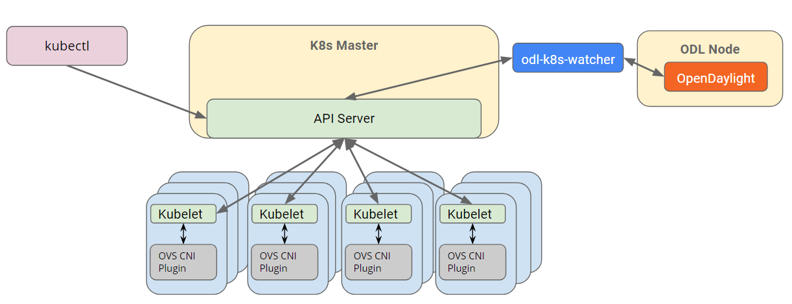

.. contents:: Table of Contents
      :depth: 5

=======================
Netvirt COE Integration
=======================

https://git.opendaylight.org/gerrit/#/q/topic:coe_integration

This spec proposes how to integrate COE and Netvirt projects for enabling
networking(L2 and L3 support) for containers.

COE(Container Orchestration Engine) project aims at developing a framework for integrating
Container Orchestration Engine (like Kubernetes) and OpenDaylight. Netvirt will serve as
the backend for COE, as Netvirt provides generic enough constructs which will work
for VMs as well as Containers.

Problem Description
===================

Current Netvirt project does not have a driver that will work with Kubernetes baremetal cluster.
COE project aims at enabling the same, and will require a plugin in Netvirt project
to convert the events from Kubernetes to the required constructs in Netvirt.

Network Requirements
====================
k8s imposes some fundamental requirements on the networking implementation:

* All containers can communicate without NAT.

* All nodes can communicate with containers without NAT.

* The IP the container sees itself is the same IP that others see.

The Kubernetes model is for each pod to have an IP in a flat shared namespace
that allows full communication with physical computers and containers across
the network.

High-Level Components:
======================

The high level view of the end to end solution is given in the below picture :

Proposed change
===============

A new module called `coe` will be added in Netvirt which will serve as the watcher
for all the container orchestration related events. This module will be responsible for
converting the COE related constructs to Netvirt constructs.

Netvirt Changes
---------------

DHCP Module
^^^^^^^^^^^

COE will be using DHCP dynamic allocation feature in Netvirt, which has some missing parts
for the integration to work. DHCP module's bind service logic so far works only for neutron ports.
This has to be enhanced to work for k8s pods as well.

ARP Responder
^^^^^^^^^^^^^

ARP responder logic of Netvirt works only for neutron ports, this needs enhancements to work with
k8s ports, so that ARP responses can be sent from OVS directly, without the need for sending the same
to ODL.

Genius changes
--------------

InterfaceManager
^^^^^^^^^^^^^^^^

IntefaceManager currently treats only nova port patterns(tap/vhu) as well as tunnel port patterns as
unique. For any other portnames datapath-node-id will be prefixed to the port-name. CNI plugin
creates unique ports which starts with "veth" prefix, and this needs to be added to the set of unique
port patterns in Genius.

Use Cases
---------

Use Case 1:
^^^^^^^^^^^
This will enable default Kubernetes behavior to allow all
traffic from all sources inside or outside the cluster to all pods within the
cluster. This use case does not add multi-tenancy support.

Use Case 2:
^^^^^^^^^^^
Network isolation policy will impose limitations on the connectivity from an optional set of
traffic sources to an optional set of destination TCP/UDP ports.
Regardless of network policy, pods should be accessible by the host on which
they are running to allow local health checks. This use case does not address
multi-tenancy.

More enhanced use cases can be added in the future, that will allow to add
extra functionality

Model Mapping
-------------

In order to support Kubernetes networking via Netvirt, we should define how
COE model maps into Netvirt model.

+-----------------+-------------------+---------------------------------------+
| **COE entity**  | **Netvirt entity**| **notes**                             |
+=================+===================+=======================================+
|node + namespace | elan-instance     |  Whenever the first pod under         |
|                 |                   |  a namespace in a node is created,an  |
|                 |                   |  elan-instance has to be created.     |
+-----------------+-------------------+---------------------------------------+
|namespace        | vpn-instance      |  Whenever the first pod under a       |
|                 |                   |  namespace is created, a vpn-instance |
|                 |                   |  has to be created.                   |
+-----------------+-------------------+---------------------------------------+
|pod              | elan-interface    | For each pod created, an              |
|                 |                   | elan-interface has to be created,     |
|                 |                   | based on its node and namespace       |
+-----------------+-------------------+---------------------------------------+
|pod              | vpn-interface     | For each pod created, a               |
|                 |                   | vpn-interface has to be created,      |
|                 |                   | based on its namespace                |
+-----------------+-------------------+---------------------------------------+

Pipeline Changes
----------------

No pipeline changes will be introduced as part of this feature.

Workflow
--------

Configure DHCP Pool(Optional)
^^^^^^^^^^^^^^^^^^^^^^^^^^^^^
#. netvirt/dhcpmanager: For an immediate solution, a flat dhcp pool will be precreated
   manually, and IPs will be allocated for PODs from this pool.
#. netvirt/dhcpmanager: For an immediate solution, a flat service pool will be precreated
   manually, and IPs will be allocated for SERVICEs from this pool.

Create Pod
^^^^^^^^^^
#. coe/coe-northbound: User created a POD
#. netvirt/coe: When the first POD is created under a namespace in a node, coe module in Netvirt will
   create an elan-instance with node-ip:namespace as the name. Also, for each POD, an ietf-interface
   as well as an elan-interface objects will be created in the MD-SAL datastore, with name
   set as "namespace:pod-name".
#. netvirt/coe: When the first POD is created under a namespace, coe module in Netvirt will
   create a vpn-instance with namespace as the name. Also, for each POD, a vpn-interface object
   will be created in the MD-SAL datastore with name set as "namespace:pod-name".
#. coe/cni-plugin:  The cni plugin in k8s will create the tap port on the OVS with external-id
   set to the "namespace:pod-name".
#. genius/interfacemanager: Whenever the tapport is created, interfacemanager will take care of
   programming table0(Lport Ingress Table) and table220(Egress Dispatcher Table) programming,
   and population of interface-state.
#. netvirt/elanmanager: Whenever interface-state is created, elanmanager will take care of
   populating all L2 related flows in OVS.
#. netvirt/vpnmanager: Whenever interface-state is created, vpnmanager will take care of
   populating all L3 related flows in OVS.

Create Service
^^^^^^^^^^^^^^

#. netvirt/coe: When a pod is attached to a service, floating-ip-info has to be populated
#. netvirt/natmanager: Listens on floating-ip-changes and do the NATing as it is done currently.

Delete Service
^^^^^^^^^^^^^^

#. netvirt/coe: When a pod is removed from a service, corresponding floating-ip-info will be removed.
#. netvirt/natmanager: Listens on floating-ip-changes and remove the NAT rules approporiately.

Delete Pod
^^^^^^^^^^

#. coe/coe-northbound: User deleted a POD
#. netvirt/coe: When the last POD is deleted under a namespace in a node, coe module in Netvirt will
   delete the elan-instance with namespace as the name. Also, for each POD, the corresponding ietf-interface
   as well as an elan-interface and vpn-interface objects will be deleted in the MD-SAL datastore.
#. coe/cni-plugin:  The cni plugin in k8s will delete the tap port on the OVS.
#. genius/interfacemanager: Whenever the tapport is deleted, interfacemanager will take care of
   deleting table0(Lport Ingress Table) and table220(Egress Dispatcher Table)
   flows on OVS, and deletion of interface-state.
#. netvirt/elanmanager: Whenever interface-state is deleted, elanmanager will take care of
   removing all L2 related flows in OVS.
#. netvirt/vpnmanager: Whenever interface-state is deleted, vpnmanager will take care of
   removing all L3 related flows in OVS.

Assumptions
-----------

Reboot Scenarios
----------------
This feature support all the following Reboot Scenarios for EVPN:
    *  Entire Cluster Reboot
    *  Leader PL reboot
    *  Candidate PL reboot
    *  OVS Datapath reboots
    *  Multiple PL reboots
    *  Multiple Cluster reboots
    *  Multiple reboots of the same OVS Datapath.
    *  Openstack Controller reboots

Clustering considerations
-------------------------
The feature should operate in ODL Clustered environment reliably.

Other Infra considerations
--------------------------
N.A.

Security considerations
-----------------------
N.A.

Scale and Performance Impact
----------------------------
Not covered by this Design Document.

Targeted Release
----------------
Oxygen

Alternatives
------------
An alternative for container networking is to use kuryr-kubernetes which will
work with ODL as backend. However the same will not work in an environement where Openstack
is not present. There are scenarios where Baremetal Kubernetes clusters have to work without
Openstack, and this feature comes into picture there.

Usage
=====

Features to Install
-------------------
This feature add the below new feature :

    * odl-netvirt-coe

REST API
--------

Creating DHCP Pool
^^^^^^^^^^^^^^^^^^

**URL:** restconf/config/dhcp_allocation_pool:dhcp_allocation_pool/

**Sample JSON data**

.. code-block:: json

  {
    "dhcp_allocation_pool:network": [
     {
        "dhcp_allocation_pool:allocation-pool": [
          {
            "dhcp_allocation_pool:subnet": "192.168.10.0/24",
            "dhcp_allocation_pool:allocate-to": "192.168.10.50",
            "dhcp_allocation_pool:gateway": "192.168.10.2",
            "dhcp_allocation_pool:allocate-from": "192.168.10.3"
           }
        ],
        "dhcp_allocation_pool:network-id": "pod-namespace"
      }
    ]
  }

Creating POD directly in COE
^^^^^^^^^^^^^^^^^^^^^^^^^^^^

**URL:** restconf/config/pod:coe

**Sample JSON data**

.. code-block:: json

  {
    "pod:pods": [
      {
        "pod:version": "Some version",
        "pod:uid": "AC092D9B-E9Eb-BAE2-eEd8-74Aca2B7Fa9C",
        "pod:interface": [
          {
            "pod:uid": "7bA91A3A-f17E-2eBB-eDec-3BBBEa27DCa7",
            "pod:ip-address": "0.147.0.7",
            "pod:network-id": "fBAD80df-B0B4-0580-8D14-11FcaCED2ac6",
            "pod:network-type": "FLAT",
            "pod:segmentation-id": "0"
          }
        ]
      }
    ]
  }

Creating SERVICE directly in COE
^^^^^^^^^^^^^^^^^^^^^^^^^^^^^^^^

**URL:** restconf/config/service:service-information

**Sample JSON data**

.. code-block:: json

  {
    "service:service-information": {
      "service:services": [
        {
          "service:uid": "EeafFFB7-D9Fc-aAeD-FBc9-8Af8BFaacDD9",
          "service:cluster-ip-address": "5.21.5.0",
          "service:endpoints": [
            "AFbcF0EB-Fc3f-acea-A438-5CFDfCEfbcb0"
          ]
        }
      ]
    }
  }

Assignee(s)
-----------

Primary assignee:
  Faseela K <faseela.k@ericsson.com>

Other contributors:
   Frederick Kautz <fkautz@redhat.com>

   Mohamed El-serngawy <m.elserngawy@gmail.com>

Work Items
----------

Dependencies
============

Testing
=======

Junits
------

This feature will support following use cases:

* TC 1: Create a POD within a node under a namespace
* TC 2: Attach a POD to service
* TC 3: Remove a POD from service
* TC 4: Delete a POD from a namespace

CSIT
----
CSIT will be enhanced to cover this feature by providing new CSIT tests.

Documentation Impact
====================
This will require changes to User Guide and Developer Guide.

References
==========

* OpenStack Spec  - https://review.openstack.org/#/c/453160
* kuryr k8s integration - https://review.openstack.org/#/c/281132/14/doc/source/specs/mitaka/kuryr_k8s_integration.rst
* cni plugin proposal - https://docs.google.com/presentation/d/1-gBGZ1zQQ1d9-ZLPuBbWx5PTb9MgxduRoAl2Z7gL2Zo/edit#slide=id.g29f465fad4_0_86
* coe cni specification - https://docs.google.com/presentation/d/1DPfRSc11CzTa_qzvzQ-P7wQH0dPylag4eYT9sH06ajg/edit#slide=id.p