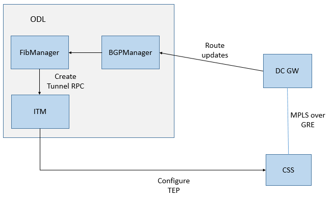

==============================
Soft-GRE support on Controller
==============================

[link to gerrit patch] TBD

Controller should allow dynamic creation of overlay (MPLSoverGRE) tunnels from OVSs to DCGWs, as and when a ‘new’ Nexthop IP address is found in route updates received from BGP neighbors.

Problem description
===================

Currently there is no dynamic creation of overlay tunnels. All the tunnels from OVS to DCGW have to be created by user explicitly by invoking the REST APIs to create external tunnel endpoints.

Use Cases
---------

The changes in Controller must include the following
#. FibManager should determine new remote gateway ip from the nexthop address found in route update received from BGP neighbors (via BGPManager) and create tunnels dynamically.
#. FibManager should delete tunnels to external TEP when there are no route entries corresponding to the external tep in the FibTable.

Proposed change
===============

Design Diagram
--------------

Code Changes
----------------

Addition of external TEP and tunnels creation
^^^^^^^^^^^^^^^^^^^^^^^^^^^^^^^^^^^^^^^^^^^^^

#. BgpManager updates the FIB whenever routeupdates are received from BGP Neighbor
#. VrfEntryListener (DataTreeChangeListener) in FibManager listens for the VrfEntry updates when route update is received from BGP Neighbor. Check for NLRi nexthop attribute for the gateway ip.
#. Maintain the counter fibEntriesCount in Operational DS to keep track of number of fib entries per gateway ip. Whenever route updates (add/delete) are received update this counter value.
#. Check the itm config datastore for gateway ip to determine whether tunnels already do not exist for the gateway ip. (As part of "ITM DCGW Persistence" ITM updates this attribute in config DS after successful creation of tunnels). This check is to avoid triggering tunnels creation on subsequent routeupdates from the  same gateway. Local caching will be used to avoid multiple DS hits.
#. If there is no entry found in the itm Config DS, call the itm rpc ``add-external-tunnel-endpoint`` to create endpoint in ITM which will create the tunnels for each of the configured OVS to the external tep.
#. After this, "ITM DCGW Persistence" will listen to tunnel creation events and programmes data plane accordingly (program/remove flows on OVS).

Removal of Tunnels
^^^^^^^^^^^^^^^^^^

#. BgpManager removes the fib entries when routes are withdrawn from gateway.
#. VrfEntryListener in FibManager listens for the VrfEntries deletion and checks the nexthop attribute whether the removal is for gateway ip. 
#. If there is a match decrement the fibEntriesCount.
#. In case the VrfEntry being removed is last one for a specific gateway ip, call the itm rpc ``remove-external-tunnel-endpoint`` which will delete all the tunnels from each of the OVS towards that gateway.

Pipeline changes
----------------
NA

Yang changes
------------
New grouping dcgw-fibentries-mapping will be added into fibmanager-api/odl-fib.yang to keep track of FibEntries per DC-GW

Configuration impact
---------------------
Manual configurations for tunnels to DCGW at 0 day will not be required.

Clustering considerations
-------------------------
None

Other Infra considerations
--------------------------
None

Security considerations
-----------------------
None

Scale and Performance Impact
----------------------------
TBD

Targeted Release
-----------------
ODL Carbon

Alternatives
------------
Already existing manual configuration of tunnels via REST.

Usage
=====

Features to Install
-------------------
odl-netvirt-openstack

This will be part of existing feature odl-netvirt-openstack
Identify existing karaf feature to which this change applies and/or new karaf
features being introduced. These can be user facing features which are added
to integration/distribution or internal features to be used by other projects.

REST API
--------
When the Config DataStore parameter "enable-softgre" is not set to False, the support for dynamic creation of tunnels will get enabbled. The Default value will be True.

TBD: yang file and json to be finalised

CLI
---
None

Implementation
==============

Assignee(s)
-----------

Primary assignee:
  <Vijayalakshmi>

Other contributors:
  <Jatinder>

Work Items
----------
Enable/Disable Features
^^^^^^^^^^^^^^^^^^^^^^^

#. Yang changes

Creation of TEPs
^^^^^^^^^^^^^^^^

#. Listen to VrfEntry additions/updates on BGP Neighbor route updates.
#. Get required parameters i.e, NextHop ip, fibEntriesCount counter and update counter values.
#. Check whether tunnels are already configured.
#. Make call to ITM for creation of tunnels between each of the configured OVSs and DC-Gateway.

Deletion of TEPs
^^^^^^^^^^^^^^^^

#. Listen to VrfEntry deletion
#. Check counter values for the DCGW ip (NextHop ip)
#. Make call to ITM for deletion of tunnels. 

Dependencies
============
"ITM DCGW Persistence" and "ITM" for tunnel creation.

Testing
=======
TBD

Unit Tests
----------
Appropriate UTs will be added for the new code coming in, once UT framework is in place.

Integration Tests
-----------------

CSIT
----

Documentation Impact
====================
TBD

References
==========

